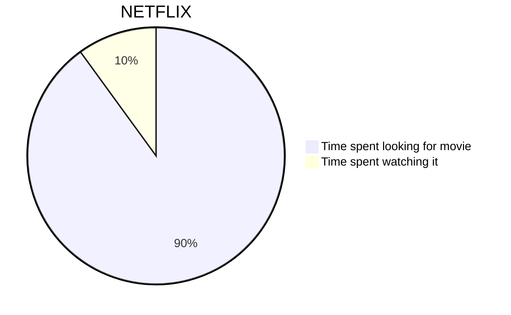

# Goto-Grocery-MRM
## Group 35 - Clean up in isle 5

## Set up the program
1. Create an Atlas URI connection parameter in `server/config.env` with your Atlas URI:
> ```properties
> ATLAS_URI=mongodb+srv://<username>:<password>@<cluster>.<cluster-shard>.mongodb.net/<database_name>?retryWrites=true&w=majority
> PORT=5000
> NODE_ENV=development
> ```
2. Install NodeJS (with npm)
3. Open Terminal and enter `npm install`
4. Enter `npm start`

## How to run the application
Start server and web server concurrently:
```properties
npm start
```

Start server:
```properties
cd server
npm start
```

Start Web server
```properties
cd client
npm start
```



Resources:
* https://github.com/mongodb-developer/nodejs-quickstart/blob/master/transaction-bankingexample.js
* https://github.com/mongodb-developer/nodejs-quickstart/blob/master/transaction-inventoryexample.js
